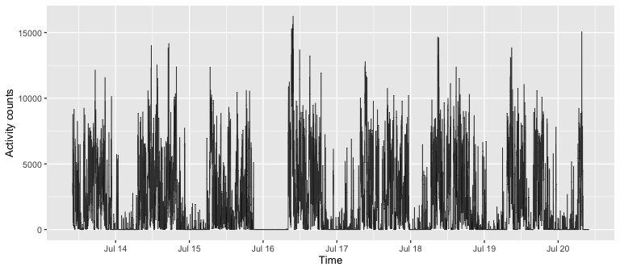

arcstats
================

  - [Installation](#installation)
  - [Documentation](#documentation)
  - [Using `arcstats` package to compute physical activity
    summaries](#using-arcstats-package-to-compute-physical-activity-summaries)
      - [Reading PA data](#reading-pa-data)
      - [Computing summaries with `activity_stats`
        method](#computing-summaries-with-activity_stats-method)
      - [Output explained](#output-explained)
  - [Additional`activity_stats` method
    options](#additionalactivity_stats-method-options)
      - [Summarizing PA only in a chosen time-of-day
        subset](#summarizing-pa-only-in-a-chosen-time-of-day-subset)
      - [Summarizing PA with a chosen time-of-day
        excluded](#summarizing-pa-with-a-chosen-time-of-day-excluded)
      - [Summarizing PA excluding in-bed
        time](#summarizing-pa-excluding-in-bed-time)
  - [Components of `activity_stats`
    method](#components-of-activity_stats-method)
      - [Expand the length of minute-level AC vector to integer number
        of full 24-hour periods by NA-padding with
        `midnight_to_midnight`](#expand-the-length-of-minute-level-ac-vector-to-integer-number-of-full-24-hour-periods-by-na-padding-with-midnight_to_midnight)
      - [Get wear/non-wear flag with
        `get_wear_flag`](#get-wearnon-wear-flag-with-get_wear_flag)
      - [Get valid/non-valid day flag with
        `get_valid_day_flag`](#get-validnon-valid-day-flag-with-get_valid_day_flag)
      - [Impute missing data with
        `impute_missing_data`](#impute-missing-data-with-impute_missing_data)
      - [Create PA characteristics with
        `summarize_PA`](#create-pa-characteristics-with-summarize_pa)

<!-- README.md is generated from README.Rmd. Please edit that file -->

<!-- badges: start -->

<!-- badges: end -->

The `arcstats` package allows to generate summaries of the minute-level
physical activity (PA) data. The default parameters are chosen for the
Actigraph activity counts collected with a wrist-worn device; however,
the package can be used for all minute-level PA data with the
corresponding timepstamps vector.

Below, we demonstrate the use of `arcstats` with the attached, exemplary
minute-level Actigraph PA counts data.

## Installation

You can install the released version of arcstats from
[GitHub](https://github.com/). Note you may need to install `devtools`
package if not yet installed (the line commened below).

``` r
# install.packages("devtools")
devtools::install_github("martakarass/arcstats")
```

## Documentation

A PDF with detailed documentation of all methods can be accessed
[here](https://www.dropbox.com/s/cfnud6zxntub7a7/arcstats_0.1.1.pdf?dl=1).

# Using `arcstats` package to compute physical activity summaries

### Reading PA data

Four CSV data sets with minute-level activity counts data are attached
to the `arcstats` package. The data file names are stored in
`extdata_fnames`.

``` r
library(arcstats)
library(data.table)
library(dplyr)
library(lubridate)
library(ggplot2)

## Read one of the data sets
fpath <- system.file("extdata", extdata_fnames[1], package = "arcstats")
dat   <- as.data.frame(fread(fpath))
rbind(head(dat, 3), tail(dat, 3))
#>       Axis1 Axis2 Axis3 vectormagnitude           timestamp
#> 1      1021  1353  2170            2754 2018-07-13 10:00:00
#> 2      1656  1190  2212            3009 2018-07-13 10:01:00
#> 3      2540  1461  1957            3524 2018-07-13 10:02:00
#> 10078     0     0     0               0 2018-07-20 09:57:00
#> 10079     0     0     0               0 2018-07-20 09:58:00
#> 10080     0     0     0               0 2018-07-20 09:59:00
```

The data columns are:

  - `Axis1` - sensor’s X axis minute-level counts data,
  - `Axis2` - sensor’s Y axis minute-level counts data,
  - `Axis3` - sensor’s Z axis minute-level counts data,
  - `vectormagnitude` - minute-level counts data defined as
    `sqrt(Axis1^2 + Axis2^2 + Axis3^2)`,
  - `timestamp` - time-stamps corresponding to minute-level measures.

<!-- end list -->

``` r
## Plot activity counts
ggplot(dat, aes(x = ymd_hms(timestamp), y = vectormagnitude)) + 
  geom_line(size = 0.3, alpha = 0.8) + 
  labs(x = "Time", y = "Activity counts") + 
  theme_gray(base_size = 10) + 
  scale_x_datetime(date_breaks = "1 day", date_labels = "%b %d")
```



### Computing summaries with `activity_stats` method

``` r
acc    <- dat$vectormagnitude
acc_ts <- ymd_hms(dat$timestamp)

activity_stats(acc, acc_ts)
```

<table class="table" style="font-size: 14px; margin-left: auto; margin-right: auto;">

<thead>

<tr>

<th style="text-align:right;">

n\_days

</th>

<th style="text-align:right;">

n\_valid\_days

</th>

<th style="text-align:right;">

wear\_time\_on\_valid\_days

</th>

<th style="text-align:right;">

tac

</th>

<th style="text-align:right;">

tlac

</th>

<th style="text-align:right;">

ltac

</th>

</tr>

</thead>

<tbody>

<tr>

<td style="text-align:right;">

8

</td>

<td style="text-align:right;">

4

</td>

<td style="text-align:right;">

1440

</td>

<td style="text-align:right;">

2826648

</td>

<td style="text-align:right;">

6429.838

</td>

<td style="text-align:right;">

14.8546

</td>

</tr>

</tbody>

</table>

<table class="table" style="font-size: 14px; margin-left: auto; margin-right: auto;">

<thead>

<tr>

<th style="text-align:right;">

astp

</th>

<th style="text-align:right;">

satp

</th>

<th style="text-align:right;">

time\_spent\_active

</th>

<th style="text-align:right;">

time\_spent\_nonactive

</th>

</tr>

</thead>

<tbody>

<tr>

<td style="text-align:right;">

0.1781782

</td>

<td style="text-align:right;">

0.0951621

</td>

<td style="text-align:right;">

499.5

</td>

<td style="text-align:right;">

940.5

</td>

</tr>

</tbody>

</table>

<table class="table" style="font-size: 14px; margin-left: auto; margin-right: auto;">

<thead>

<tr>

<th style="text-align:right;">

no\_of\_active\_bouts

</th>

<th style="text-align:right;">

no\_of\_nonactive\_bouts

</th>

<th style="text-align:right;">

mean\_active\_bout

</th>

<th style="text-align:right;">

mean\_nonactive\_bout

</th>

</tr>

</thead>

<tbody>

<tr>

<td style="text-align:right;">

89

</td>

<td style="text-align:right;">

89.5

</td>

<td style="text-align:right;">

5.61236

</td>

<td style="text-align:right;">

10.50838

</td>

</tr>

</tbody>

</table>

### Output explained

To explain `activity_stats` method output, we define activity count,
active/non-active minute, and active/non-active bout.

  - Activity count (AC) - a munute-level metric of PA volume
  - Active minute - AC labeled as active (non-sedentary). For Wrist-worn
    Actigraph we use AC\>=1853 (defaut threshold).
  - Active bout - sequence of \>=1 consecutive active minute(s).
  - Valid day - a day with less than 10% of the non-wear time (see
    `?get_wear_flag` for wear/non-wear time detection details).

Meta information:

  - `n_days` - number of days (unique day dates) of data collection.
  - `n_valid_days` - number of days (unique day dates) of data
    collection determined as valid days.
  - `wear_time_on_valid_days` - average number of wear-time minutes
    across valid days.

Summaries of PA volumes metrics:

  - `tac` - TAC, Total activity counts per day - sum of AC measured on
    valid days divided by the number of valid days.
  - `tlac` - TLAC, Total-log activity counts per day - sum of log(1+AC)
    measured on valid days divided by the number of valid days. Here
    ‘log’ denotes the natural logarithm.
  - `ltac` - LTAC, Log-total activity counts - natural logarithm of TAC.
  - `time_spent_active` - Average number of active minutes per valid
    day.
  - `time_spent_nonactive` - Average number of sedentary minutes per
    valid day.

Summaries of PA fragmentation metrics:

  - `astp` - ASTP, active to sedentary transition probability on valid
    days.
  - `satp` - SATP, sedentary to active transition probability on valid
    days.
  - `no_of_active_bouts` - Average number of active minutes per valid
    day.
  - `no_of_nonactive_bouts` - Average number of sedentary minutes per
    valid day.
  - `mean_active_bout` - Average duration (in minutes) of an active bout
    on valid days.
  - `mean_nonactive_bout` - Average duration (in minutes) of a sedentary
    bout on valid days.

# Additional`activity_stats` method options

### Summarizing PA only in a chosen time-of-day subset

The `subset_minutes` argument allows to specify subset of a day’s
minutes where activity summaries should be computed. There are 1440
minutes in a 24-hour day where `1` denotes 1st minute of the day (from
00:00 to 00:01), and `1440` denotes the last minute (from 23:59 to
00:00).

Here, we summarize PA observed between 12:00 AM and 6:00 AM.

``` r
subset_12am_6am <- 1 : (6 * 1440/24)
activity_stats(acc, acc_ts, subset_minutes = subset_12am_6am) 
```

<table class="table" style="font-size: 14px; margin-left: auto; margin-right: auto;">

<thead>

<tr>

<th style="text-align:right;">

n\_days

</th>

<th style="text-align:right;">

n\_valid\_days

</th>

<th style="text-align:right;">

wear\_time\_on\_valid\_days

</th>

<th style="text-align:right;">

tac\_0to6only

</th>

<th style="text-align:right;">

tlac\_0to6only

</th>

<th style="text-align:right;">

ltac\_0to6only

</th>

</tr>

</thead>

<tbody>

<tr>

<td style="text-align:right;">

8

</td>

<td style="text-align:right;">

4

</td>

<td style="text-align:right;">

1440

</td>

<td style="text-align:right;">

65477.5

</td>

<td style="text-align:right;">

322.1523

</td>

<td style="text-align:right;">

11.08946

</td>

</tr>

</tbody>

</table>

<table class="table" style="font-size: 14px; margin-left: auto; margin-right: auto;">

<thead>

<tr>

<th style="text-align:right;">

astp\_0to6only

</th>

<th style="text-align:right;">

satp\_0to6only

</th>

<th style="text-align:right;">

time\_spent\_active\_0to6only

</th>

<th style="text-align:right;">

time\_spent\_nonactive\_0to6only

</th>

</tr>

</thead>

<tbody>

<tr>

<td style="text-align:right;">

0.5581395

</td>

<td style="text-align:right;">

0.0200429

</td>

<td style="text-align:right;">

10.75

</td>

<td style="text-align:right;">

349.25

</td>

</tr>

</tbody>

</table>

<table class="table" style="font-size: 14px; margin-left: auto; margin-right: auto;">

<thead>

<tr>

<th style="text-align:right;">

no\_of\_active\_bouts\_0to6only

</th>

<th style="text-align:right;">

no\_of\_nonactive\_bouts\_0to6only

</th>

<th style="text-align:right;">

mean\_active\_bout\_0to6only

</th>

<th style="text-align:right;">

mean\_nonactive\_bout\_0to6only

</th>

</tr>

</thead>

<tbody>

<tr>

<td style="text-align:right;">

6

</td>

<td style="text-align:right;">

7

</td>

<td style="text-align:right;">

1.791667

</td>

<td style="text-align:right;">

49.89286

</td>

</tr>

</tbody>

</table>

By default, column names have a suffix added to denote that a subset of
munutes was used (here, `_0to6only`). This can be disabled by setting
`adjust_out_colnames` to `FALSE`.

``` r
subset_12am_6am = 1 : (6/24 * 1440)
subset_6am_12pm = (6/24 * 1440 + 1) : (12/24 * 1440) 
subset_12pm_6pm = (12/24 * 1440 + 1) : (18/24 * 1440) 
subset_6pm_12am = (18/24 * 1440 + 1) : (24/24 * 1440) 
out <- rbind(
  activity_stats(acc, acc_ts, subset_minutes = subset_12am_6am, adjust_out_colnames = FALSE),
  activity_stats(acc, acc_ts, subset_minutes = subset_6am_12pm, adjust_out_colnames = FALSE),
  activity_stats(acc, acc_ts, subset_minutes = subset_12pm_6pm, adjust_out_colnames = FALSE),
  activity_stats(acc, acc_ts, subset_minutes = subset_6pm_12am, adjust_out_colnames = FALSE))
rownames(out) <- c("12am-6am", "6am-12pm", "12pm-6pm", "6pm-12am")
out
```

<table class="table" style="font-size: 14px; margin-left: auto; margin-right: auto;">

<thead>

<tr>

<th style="text-align:left;">

</th>

<th style="text-align:right;">

n\_days

</th>

<th style="text-align:right;">

n\_valid\_days

</th>

<th style="text-align:right;">

wear\_time\_on\_valid\_days

</th>

<th style="text-align:right;">

tac

</th>

<th style="text-align:right;">

tlac

</th>

<th style="text-align:right;">

ltac

</th>

</tr>

</thead>

<tbody>

<tr>

<td style="text-align:left;">

12am-6am

</td>

<td style="text-align:right;">

8

</td>

<td style="text-align:right;">

4

</td>

<td style="text-align:right;">

1440

</td>

<td style="text-align:right;">

65477.5

</td>

<td style="text-align:right;">

322.1523

</td>

<td style="text-align:right;">

11.08946

</td>

</tr>

<tr>

<td style="text-align:left;">

6am-12pm

</td>

<td style="text-align:right;">

8

</td>

<td style="text-align:right;">

4

</td>

<td style="text-align:right;">

1440

</td>

<td style="text-align:right;">

1089788.5

</td>

<td style="text-align:right;">

2139.4534

</td>

<td style="text-align:right;">

13.90149

</td>

</tr>

<tr>

<td style="text-align:left;">

12pm-6pm

</td>

<td style="text-align:right;">

8

</td>

<td style="text-align:right;">

4

</td>

<td style="text-align:right;">

1440

</td>

<td style="text-align:right;">

994104.8

</td>

<td style="text-align:right;">

2194.8539

</td>

<td style="text-align:right;">

13.80960

</td>

</tr>

<tr>

<td style="text-align:left;">

6pm-12am

</td>

<td style="text-align:right;">

8

</td>

<td style="text-align:right;">

4

</td>

<td style="text-align:right;">

1440

</td>

<td style="text-align:right;">

677277.5

</td>

<td style="text-align:right;">

1773.3781

</td>

<td style="text-align:right;">

13.42584

</td>

</tr>

</tbody>

</table>

<table class="table" style="font-size: 14px; margin-left: auto; margin-right: auto;">

<thead>

<tr>

<th style="text-align:left;">

</th>

<th style="text-align:right;">

astp

</th>

<th style="text-align:right;">

satp

</th>

<th style="text-align:right;">

time\_spent\_active

</th>

<th style="text-align:right;">

time\_spent\_nonactive

</th>

</tr>

</thead>

<tbody>

<tr>

<td style="text-align:left;">

12am-6am

</td>

<td style="text-align:right;">

0.5581395

</td>

<td style="text-align:right;">

0.0200429

</td>

<td style="text-align:right;">

10.75

</td>

<td style="text-align:right;">

349.25

</td>

</tr>

<tr>

<td style="text-align:left;">

6am-12pm

</td>

<td style="text-align:right;">

0.1501377

</td>

<td style="text-align:right;">

0.1540616

</td>

<td style="text-align:right;">

181.50

</td>

<td style="text-align:right;">

178.50

</td>

</tr>

<tr>

<td style="text-align:left;">

12pm-6pm

</td>

<td style="text-align:right;">

0.1751337

</td>

<td style="text-align:right;">

0.1864162

</td>

<td style="text-align:right;">

187.00

</td>

<td style="text-align:right;">

173.00

</td>

</tr>

<tr>

<td style="text-align:left;">

6pm-12am

</td>

<td style="text-align:right;">

0.2037422

</td>

<td style="text-align:right;">

0.1032325

</td>

<td style="text-align:right;">

120.25

</td>

<td style="text-align:right;">

239.75

</td>

</tr>

</tbody>

</table>

<table class="table" style="font-size: 14px; margin-left: auto; margin-right: auto;">

<thead>

<tr>

<th style="text-align:left;">

</th>

<th style="text-align:right;">

no\_of\_active\_bouts

</th>

<th style="text-align:right;">

no\_of\_nonactive\_bouts

</th>

<th style="text-align:right;">

mean\_active\_bout

</th>

<th style="text-align:right;">

mean\_nonactive\_bout

</th>

</tr>

</thead>

<tbody>

<tr>

<td style="text-align:left;">

12am-6am

</td>

<td style="text-align:right;">

6.00

</td>

<td style="text-align:right;">

7.00

</td>

<td style="text-align:right;">

1.791667

</td>

<td style="text-align:right;">

49.892857

</td>

</tr>

<tr>

<td style="text-align:left;">

6am-12pm

</td>

<td style="text-align:right;">

27.25

</td>

<td style="text-align:right;">

27.50

</td>

<td style="text-align:right;">

6.660551

</td>

<td style="text-align:right;">

6.490909

</td>

</tr>

<tr>

<td style="text-align:left;">

12pm-6pm

</td>

<td style="text-align:right;">

32.75

</td>

<td style="text-align:right;">

32.25

</td>

<td style="text-align:right;">

5.709924

</td>

<td style="text-align:right;">

5.364341

</td>

</tr>

<tr>

<td style="text-align:left;">

6pm-12am

</td>

<td style="text-align:right;">

24.50

</td>

<td style="text-align:right;">

24.75

</td>

<td style="text-align:right;">

4.908163

</td>

<td style="text-align:right;">

9.686869

</td>

</tr>

</tbody>

</table>

### Summarizing PA with a chosen time-of-day excluded

The `exclude_minutes` argument allows to specify subset of a day’s
minutes excluded for computing activity summaries.

Here, we summarize PA while excluding observatins between 11:00 PM and
5:00 AM.

``` r
subset_11pm_5am <- c(
  (23 * 1440/24 + 1) : 1440,   ## 11:00 PM - midnight
  1 : (5 * 1440/24)            ## midnight - 5:00 AM
) 
activity_stats(acc, acc_ts, exclude_minutes = subset_11pm_5am) 
```

<table class="table" style="font-size: 14px; margin-left: auto; margin-right: auto;">

<thead>

<tr>

<th style="text-align:right;">

n\_days

</th>

<th style="text-align:right;">

n\_valid\_days

</th>

<th style="text-align:right;">

wear\_time\_on\_valid\_days

</th>

<th style="text-align:right;">

tac\_23to5removed

</th>

<th style="text-align:right;">

tlac\_23to5removed

</th>

<th style="text-align:right;">

ltac\_23to5removed

</th>

</tr>

</thead>

<tbody>

<tr>

<td style="text-align:right;">

8

</td>

<td style="text-align:right;">

4

</td>

<td style="text-align:right;">

1440

</td>

<td style="text-align:right;">

2735749

</td>

<td style="text-align:right;">

6052.84

</td>

<td style="text-align:right;">

14.82192

</td>

</tr>

</tbody>

</table>

<table class="table" style="font-size: 14px; margin-left: auto; margin-right: auto;">

<thead>

<tr>

<th style="text-align:right;">

astp\_23to5removed

</th>

<th style="text-align:right;">

satp\_23to5removed

</th>

<th style="text-align:right;">

time\_spent\_active\_23to5removed

</th>

<th style="text-align:right;">

time\_spent\_nonactive\_23to5removed

</th>

</tr>

</thead>

<tbody>

<tr>

<td style="text-align:right;">

0.1702018

</td>

<td style="text-align:right;">

0.1395057

</td>

<td style="text-align:right;">

483.25

</td>

<td style="text-align:right;">

596.75

</td>

</tr>

</tbody>

</table>

<table class="table" style="font-size: 14px; margin-left: auto; margin-right: auto;">

<thead>

<tr>

<th style="text-align:right;">

no\_of\_active\_bouts\_23to5removed

</th>

<th style="text-align:right;">

no\_of\_nonactive\_bouts\_23to5removed

</th>

<th style="text-align:right;">

mean\_active\_bout\_23to5removed

</th>

<th style="text-align:right;">

mean\_nonactive\_bout\_23to5removed

</th>

</tr>

</thead>

<tbody>

<tr>

<td style="text-align:right;">

82.25

</td>

<td style="text-align:right;">

83.25

</td>

<td style="text-align:right;">

5.87538

</td>

<td style="text-align:right;">

7.168168

</td>

</tr>

</tbody>

</table>

### Summarizing PA excluding in-bed time

The `in_bed_time` and `out_bed_time` arguments allow to provide
day-specific in-bed periods to be excluded from analysis.

Here, we summarize PA excluding in-bed time estimated by ActiLife
software.

##### ActiLife-estimated in-bed data

The ActiLife-estimated in-bed data file is attached to the `arcstats`
package. The sleep data columns relevant are,

  - `Subject Name` - subject IDs coressponding to AC data, stored in
    `extdata_fnames`,
  - `In Bed Time` - ActiLife-estimated start of in-bed interval for each
    day of the measurement,
  - `Out Bed Time` - ActiLife-estimated end of in-bed interval. </br>

<!-- end list -->

``` r
## Read sleep details data file
SleepDetails_fname <- "BatchSleepExportDetails_2020-05-01_14-00-46.csv"
SleepDetails_fpath <- system.file("extdata", SleepDetails_fname, package = "arcstats")
SleepDetails       <- as.data.frame(fread(SleepDetails_fpath))

## Filter sleep details data to keep data correcponding to current counts data file
SleepDetails_sub <-
    SleepDetails %>%
    filter(`Subject Name` == "ID_1") %>%
    mutate(`In Bed Time`  = mdy_hms(`In Bed Time`),
           `Out Bed Time` = mdy_hms(`Out Bed Time`)) %>%
    select(`Subject Name`, `In Bed Time`, `Out Bed Time`) 
SleepDetails_sub
#>   Subject Name         In Bed Time        Out Bed Time
#> 1         ID_1 2018-07-13 21:18:00 2018-07-14 04:50:00
#> 2         ID_1 2018-07-14 22:41:00 2018-07-15 05:40:00
#> 3         ID_1 2018-07-16 19:46:00 2018-07-17 04:32:00
#> 4         ID_1 2018-07-17 23:30:00 2018-07-18 06:32:00
#> 5         ID_1 2018-07-18 22:16:00 2018-07-19 07:17:00
#> 6         ID_1 2018-07-19 22:30:00 2018-07-20 06:40:00
```

Finally, we use in/out-bed time `POSIXct` vectors in `activity_stats`
method.

``` r
in_bed_time  <- SleepDetails_sub[, "In Bed Time"]
out_bed_time <- SleepDetails_sub[, "Out Bed Time"]

activity_stats(acc, acc_ts, in_bed_time = in_bed_time, out_bed_time = out_bed_time) 
```

<table class="table" style="font-size: 14px; margin-left: auto; margin-right: auto;">

<thead>

<tr>

<th style="text-align:right;">

n\_days

</th>

<th style="text-align:right;">

n\_valid\_days

</th>

<th style="text-align:right;">

wear\_time\_on\_valid\_days

</th>

<th style="text-align:right;">

tac\_inbedremoved

</th>

<th style="text-align:right;">

tlac\_inbedremoved

</th>

<th style="text-align:right;">

ltac\_inbedremoved

</th>

</tr>

</thead>

<tbody>

<tr>

<td style="text-align:right;">

8

</td>

<td style="text-align:right;">

4

</td>

<td style="text-align:right;">

1440

</td>

<td style="text-align:right;">

2746582

</td>

<td style="text-align:right;">

6062.753

</td>

<td style="text-align:right;">

14.82587

</td>

</tr>

</tbody>

</table>

<table class="table" style="font-size: 14px; margin-left: auto; margin-right: auto;">

<thead>

<tr>

<th style="text-align:right;">

astp\_inbedremoved

</th>

<th style="text-align:right;">

satp\_inbedremoved

</th>

<th style="text-align:right;">

time\_spent\_active\_inbedremoved

</th>

<th style="text-align:right;">

time\_spent\_nonactive\_inbedremoved

</th>

</tr>

</thead>

<tbody>

<tr>

<td style="text-align:right;">

0.1703551

</td>

<td style="text-align:right;">

0.1580934

</td>

<td style="text-align:right;">

485.75

</td>

<td style="text-align:right;">

529.75

</td>

</tr>

</tbody>

</table>

<table class="table" style="font-size: 14px; margin-left: auto; margin-right: auto;">

<thead>

<tr>

<th style="text-align:right;">

no\_of\_active\_bouts\_inbedremoved

</th>

<th style="text-align:right;">

no\_of\_nonactive\_bouts\_inbedremoved

</th>

<th style="text-align:right;">

mean\_active\_bout\_inbedremoved

</th>

<th style="text-align:right;">

mean\_nonactive\_bout\_inbedremoved

</th>

</tr>

</thead>

<tbody>

<tr>

<td style="text-align:right;">

82.75

</td>

<td style="text-align:right;">

83.75

</td>

<td style="text-align:right;">

5.870091

</td>

<td style="text-align:right;">

6.325373

</td>

</tr>

</tbody>

</table>

# Components of `activity_stats` method

The primary method `activity_stats` is composed of several steps
implemented in their respective functions. Below, we demonstrate how to
produce `activity_stats` results step by step with these functions.

We reuse the objects:

  - `acc` - numeric vector; minute-level activity counts data,
  - `acc_ts` - POSIXct vector; minute-level time of `acc` data
    collection.

<!-- end list -->

``` r
df <- data.frame(acc = acc, acc_ts = acc_ts)
rbind(head(df, 3), tail(df, 3))
#>        acc              acc_ts
#> 1     2754 2018-07-13 10:00:00
#> 2     3009 2018-07-13 10:01:00
#> 3     3524 2018-07-13 10:02:00
#> 10078    0 2018-07-20 09:57:00
#> 10079    0 2018-07-20 09:58:00
#> 10080    0 2018-07-20 09:59:00
```

### Expand the length of minute-level AC vector to integer number of full 24-hour periods by NA-padding with `midnight_to_midnight`

  - In the returned vector, the first observation corresponds to minute
    of `00:00-00:01` on the first day of data collection, and last
    observation corresponds to minute of `23:50-00:00` on the last day
    of data collection.
  - Entries corresponding to non-measured minutes are filled with `NA`.

Here, collected data cover total of `7*24*1440 = 10080` minutes (from
`2018-07-13 10:00:00` to `2018-07-20 09:59:00`), but spans `8*24*1440
= 11520` minutes of full midnight-to-midnight days (from
`2018-07-13 00:00:00` to `2018-07-20 23:59:00`).

``` r
acc <- midnight_to_midnight(acc = acc, acc_ts = acc_ts)

## Vector length on non NA-obs, vector length after acc 
c(length(acc[!is.na(acc)]), length(acc))
#> [1] 10080 11520
```

### Get wear/non-wear flag with `get_wear_flag`

Function `get_wear_flag` computes wear/non-wear flag (`1/0`) for each
minute of activity counts data. Method implements wear/non-wear
detection algorithm proposed by Choi et al. (2011).

  - The returned vector has value `1` for wear and `0` for non-wear
    flagged minute.
  - If there is an `NA` entry in a data imput vector, then the returned
    vector will have a corresponding entry set to `NA` too.

<!-- end list -->

``` r
wear_flag <- get_wear_flag(acc)

## Proportion of wear time across the days
wear_flag_mat <- matrix(wear_flag, ncol = 1440, byrow = TRUE)
round(apply(wear_flag_mat, 1, sum, na.rm = TRUE) / 1440, 3)
#> [1] 0.583 1.000 0.874 0.679 1.000 1.000 1.000 0.338
```

### Get valid/non-valid day flag with `get_valid_day_flag`

Function `get_valid_day_flag` computes valid/non-valid day flag (`1/0`)
for each minute of activity counts data.

Here, 4 out of 8 days have more that 10% (144 minutes) of missing data.

``` r
valid_day_flag <- get_valid_day_flag(wear_flag)

## Compute number of valid days
valid_day_flag_mat <- matrix(valid_day_flag, ncol = 1440, byrow = TRUE)
apply(valid_day_flag_mat, 1, mean, na.rm = TRUE)
#> [1] 0 1 0 0 1 1 1 0
```

### Impute missing data with `impute_missing_data`

Function `impute_missing_data` imputes missing data in valid days based
on the “average day profile”.

  - An “average day profile” is computed as a minute-wise average of
    wear-time AC across valid days.

  - AC data are imputed from “average day profile” for minutes
    identified as non-wear in days identified as valid.

Here, all four valid days have 100% of wear time (recall result of
proportion of wear time across all days:
`0.583 1.000 0.874 0.679 1.000 1.000 1.000 0.338`). We hence demonstrate
the `impute_missing_data` method by artificially replacing 1h (4%) of a
valid day with non-wear.

JU: I vave no idea what the last paragraph means. I would remove it
completely.

``` r
## Copies of original objects for the purpose of demonstration
acc_cpy  <- acc
wear_flag_cpy <- wear_flag

## Artificially replace 1h (4%) of a valid day with non-wear 
repl_idx <- seq(from = 1441, by = 1, length.out = 60)
acc_cpy[repl_idx] <- 0
wear_flag_cpy[repl_idx] <- 0

## Impute data for minutes identified as non-wear in days identified as valid
acc_cpy_imputed <- impute_missing_data(acc_cpy, wear_flag_cpy, valid_day_flag)

## Compare mean activity count on valid days before and after imputation
c(mean(acc_cpy[which(valid_day_flag == 1)]), 
  mean(acc_cpy_imputed[which(valid_day_flag == 1)]))
#> [1] 1955.521 1957.186
```

### Create PA characteristics with `summarize_PA`

Finally, method `summarize_PA` computes physical all PA characteristics.

  - Same as `activity_stats`, it returns a data frame with physical
    activity summaries.
  - Same as `activity_stats`, it accepts arguments to compute physical
    activity summaries
      - within a fixed subset of minutes (arg. `subset_minutes`),
      - excluding a fixed subset of minutes (arg. `exclude_minutes`),
      - excluding day-specific in-bed intervals (args `in_bed_time`,
        `out_bed_time`). See `?summarize_PA` for more details.

Here, we summarize PA with the default parameters, across all valid
days.

``` r
summarize_PA(acc, acc_ts, wear_flag, valid_day_flag) 
```

<table class="table" style="font-size: 14px; margin-left: auto; margin-right: auto;">

<thead>

<tr>

<th style="text-align:right;">

n\_days

</th>

<th style="text-align:right;">

n\_valid\_days

</th>

<th style="text-align:right;">

wear\_time\_on\_valid\_days

</th>

<th style="text-align:right;">

tac

</th>

<th style="text-align:right;">

tlac

</th>

<th style="text-align:right;">

ltac

</th>

</tr>

</thead>

<tbody>

<tr>

<td style="text-align:right;">

8

</td>

<td style="text-align:right;">

4

</td>

<td style="text-align:right;">

1440

</td>

<td style="text-align:right;">

2826648

</td>

<td style="text-align:right;">

6429.838

</td>

<td style="text-align:right;">

14.8546

</td>

</tr>

</tbody>

</table>

<table class="table" style="font-size: 14px; margin-left: auto; margin-right: auto;">

<thead>

<tr>

<th style="text-align:right;">

astp

</th>

<th style="text-align:right;">

satp

</th>

<th style="text-align:right;">

time\_spent\_active

</th>

<th style="text-align:right;">

time\_spent\_nonactive

</th>

</tr>

</thead>

<tbody>

<tr>

<td style="text-align:right;">

0.1781782

</td>

<td style="text-align:right;">

0.0951621

</td>

<td style="text-align:right;">

499.5

</td>

<td style="text-align:right;">

940.5

</td>

</tr>

</tbody>

</table>

<table class="table" style="font-size: 14px; margin-left: auto; margin-right: auto;">

<thead>

<tr>

<th style="text-align:right;">

no\_of\_active\_bouts

</th>

<th style="text-align:right;">

no\_of\_nonactive\_bouts

</th>

<th style="text-align:right;">

mean\_active\_bout

</th>

<th style="text-align:right;">

mean\_nonactive\_bout

</th>

</tr>

</thead>

<tbody>

<tr>

<td style="text-align:right;">

89

</td>

<td style="text-align:right;">

89.5

</td>

<td style="text-align:right;">

5.61236

</td>

<td style="text-align:right;">

10.50838

</td>

</tr>

</tbody>

</table>

It returns the same results as the `activity_stats` function:

``` r
activity_stats(dat$vectormagnitude, ymd_hms(dat$timestamp))
```

<table class="table" style="font-size: 14px; margin-left: auto; margin-right: auto;">

<thead>

<tr>

<th style="text-align:right;">

n\_days

</th>

<th style="text-align:right;">

n\_valid\_days

</th>

<th style="text-align:right;">

wear\_time\_on\_valid\_days

</th>

<th style="text-align:right;">

tac

</th>

<th style="text-align:right;">

tlac

</th>

<th style="text-align:right;">

ltac

</th>

</tr>

</thead>

<tbody>

<tr>

<td style="text-align:right;">

8

</td>

<td style="text-align:right;">

4

</td>

<td style="text-align:right;">

1440

</td>

<td style="text-align:right;">

2826648

</td>

<td style="text-align:right;">

6429.838

</td>

<td style="text-align:right;">

14.8546

</td>

</tr>

</tbody>

</table>

<table class="table" style="font-size: 14px; margin-left: auto; margin-right: auto;">

<thead>

<tr>

<th style="text-align:right;">

astp

</th>

<th style="text-align:right;">

satp

</th>

<th style="text-align:right;">

time\_spent\_active

</th>

<th style="text-align:right;">

time\_spent\_nonactive

</th>

</tr>

</thead>

<tbody>

<tr>

<td style="text-align:right;">

0.1781782

</td>

<td style="text-align:right;">

0.0951621

</td>

<td style="text-align:right;">

499.5

</td>

<td style="text-align:right;">

940.5

</td>

</tr>

</tbody>

</table>

<table class="table" style="font-size: 14px; margin-left: auto; margin-right: auto;">

<thead>

<tr>

<th style="text-align:right;">

no\_of\_active\_bouts

</th>

<th style="text-align:right;">

no\_of\_nonactive\_bouts

</th>

<th style="text-align:right;">

mean\_active\_bout

</th>

<th style="text-align:right;">

mean\_nonactive\_bout

</th>

</tr>

</thead>

<tbody>

<tr>

<td style="text-align:right;">

89

</td>

<td style="text-align:right;">

89.5

</td>

<td style="text-align:right;">

5.61236

</td>

<td style="text-align:right;">

10.50838

</td>

</tr>

</tbody>

</table>
